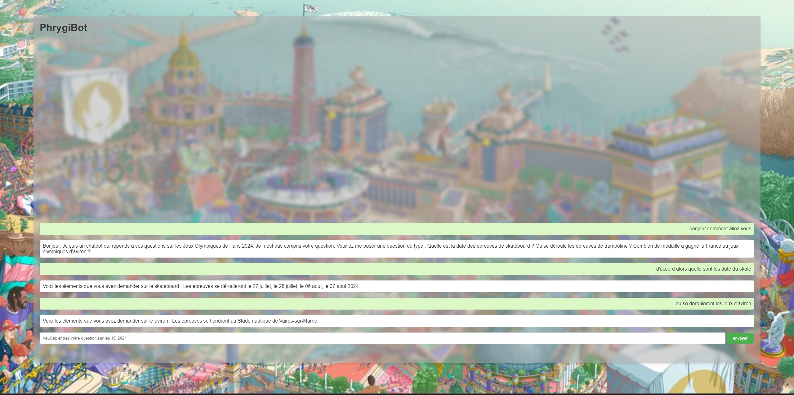

<h1 align=center>Phrygibot</h1>

<p>
  Phrygibot est un chatbot dédié à la réponse de question basique sur les Jeux Olympiques de Paris 2024. Notre projet est composé de une page html qui sert d'interface utilisateur, un programme python qui analyse et reponds à votre demande, et un serveur python du manuel de NSI 1er de Hachette qui permet de faire le lien entre la page html et le programme d'analyse python. Une vidéo de presentation du projet est present sur le site Peertube : <a href="">ici</a>
</p>

----

<h2>Prérequis</h2>

<p>
  Le projet est majoritairement codé en python, il faut donc une version de python que vous pouvez telecharger <a href="https://www.python.org/downloads/">ici</a>. Pour pouvoir executer le serveur il faut avoir telecharger les bibliothéques : jinja2 et MarkupSafe avec les commandes suivantes : 
</p>

```
pip install jinja2
```
```
pip install markupsafe
```

----

<h2>Lancement</h2>

<p>
  Pour pouvoir lancer Phrygibot, il suffit d'executer le fichier dynserveur.py . Puis d'aller sur l'addresse local : <a href='[localhost:8000](http://localhost:8000/)'>localhost:8000</a> pour pouvoir arriver sur la page du Phrygibot 
</p>

<h3>Utilsation</h3>

Si vous écrivez une phrase avec un sport et un mot clé, le bot repondra à votre question avec les information demander par le mot clé sur le sport demandé. Attention le Phrygibot fait la distinction entre les differentes phrases et peut ne pas comprendre votre demande si il y a des fautes d'orthographe .Voici la liste des mots clés utilisés par le chatbot et leur effet : 

| Types                        | Mots-clés                                                                                      |Effet                                                     |
| ---------------------------- | ---------------------------------------------------------------------------------------------- |----------------------------------------------------------|
| date                         | quand , date                                                                                   | renvoit toutes les dates des épreuves du sport           |
| debute                       | commence , debut                                                                               | renvoit la premiere date des épreuves du sport           |
| fin                          | fin , termine                                                                                  | renvoit la derniere date des épreuves du sport           |
| lieux                        | où, ou , lieux , dans , site ,                                                                 | renvoit le(s) lieux où se déroule le sport               |
| medaille                     | medaille , recompense , victoire                                                               | renvoit le nombres de medaille de la France dans ce sport|
| histoire                     | histoire, apparition                                                                           | renvoit l'année de l'apparition du sport au JO           |
| epreuves                     | epreuve                                                                                        | renvoit les differentes epreuves du sport                |

<br>
<h2>Gallerie</h2>

<p>Voici une image de notre interface graphique avec un exemple de conversation</p>


<br>

<h2>Evolution du projet dans le futur</h2>

<p>Nous avons pensé que aprés le concour finit, nous pourrions faire une version 2 du Phrygibot en utilisant du NLP (Natural Language Processing) grace au bibliothéque à la place de mots clés</p>

<br>
<h2>License</h2>

Le projet Phrygibot est sous license libre GPL v3+
